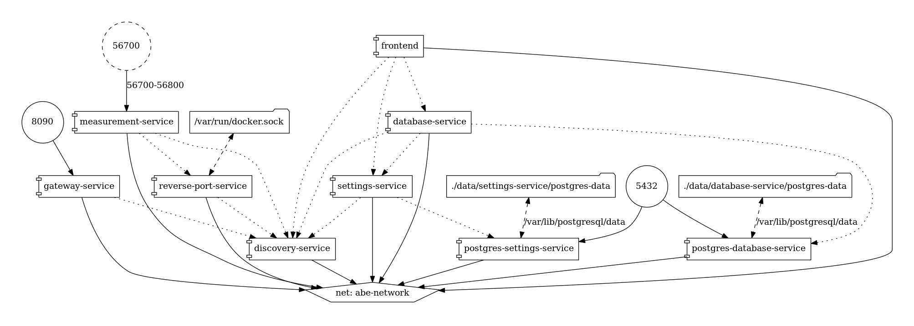
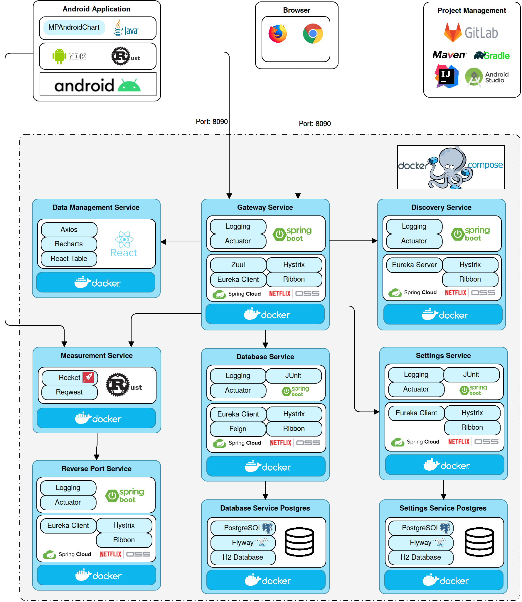

# Open Monitoring Platform for Mobile Broadband
   
## CRUSP

How does CRUSP work? 
Find the answer [here](measurement_shared_rust/README.md).
   
## Services   

 * Measurement client: [README](measurement_client_rust/README.md)
 * Measurement service: [README](measurement_server/README.md)
 * Frontend service: [README](frontend/README.md)
 * Database service [README](database-service/README.md)
 * Settings service [README](settings-service/README.md) 
   
## Building

Information about how to build the service can be found in the services.
 * Measurement client: [README](measurement_client_rust/README.md)
 * Measurement service: [README](measurement_server/README.md)
 * Frontend service: [README](frontend/README.md)

All other services can be built in their project directory with:
```bash
mvn install
```
## Running

After building all containers, you can use `docker-compose` to run all the containers at once:

```bash
docker-compose up -d
```

Furthermore, it is important to provide an `.env` file in the project's home directory.
This file provides the configuration for the databases.
Detailed information to the contents of the files can be found in the corresponding README files.

   

## Documentation  
   
### Use Cases

You can find an overview of all use cases here.

   
     
### Architecture

   
   
## Infrastructure

The software runs on a server at the university with `Void Linux` as OS.
It uses `docker-compose` to run all the services. 

The server URL is: `hossman.nt.tuwien.ac.at`

### Update OS on Server

1. At first intall updates with 
```xbps-install -Su```
2. Reboot system with 
```reboot```
3. Delete all kernel-files with 
```vkpurge rm all```


## License

The Open Monitoring Platform for Mobile Broadband is licensed under Apache License, Version 2.0, ([APACHE LICENSE](license.txt) or http://www.apache.org/licenses/LICENSE-2.0)