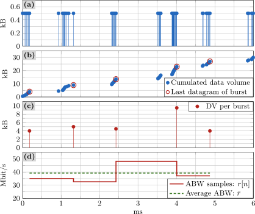
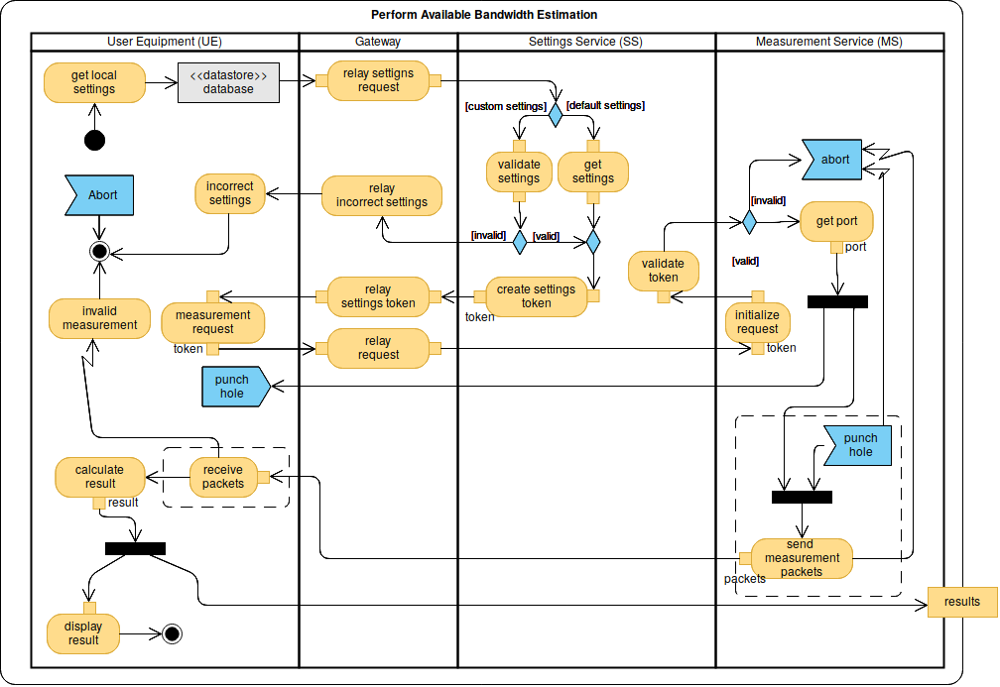
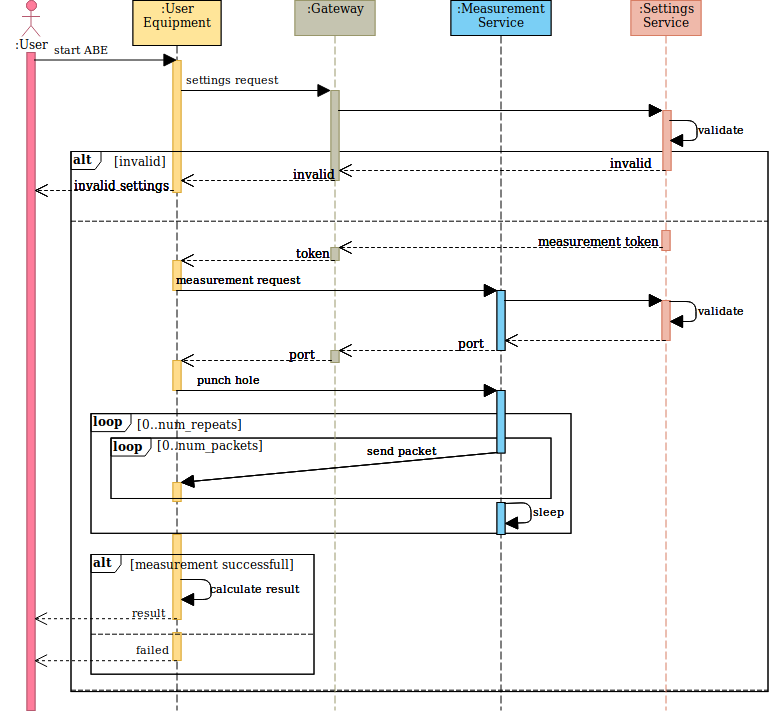

# CRUSP

## Basics

CRUSP was designed by Raida et al. [1].

In short, a sender transmits a series of UDP datagrams at a constant rate to a receiver, where they are timestamped.
Due to the nature of the radio channel, the datagrams arrive in bursts.

(a) UDP datagrams arrive in bursts. Each datagram is recorded by a timestamp.

(b) Cumulate all data volumes and identify the last datagram of each burst.

(c) For each burst sum up its data volume (DV) and map it to its last datagram.

(d) Calculate the ABW r[n] for each burst: r[n] = DV / time

A detailed description can be found [here](https://publik.tuwien.ac.at/files/publik_271502.pdf).

## Implementation

The CRUSP implementation consists of a `server` and a `client`.
* Thereby, the `client` initiates a measurement via a HTTP Request to the `server`.
* After validating the settings, the `client` receives a token, the `server` opens a UDP port for the datagrams and a TCP port for the control information.
* The `client` punches a hole into NAT/Firewalls so that the `server` can send the datagrams to the `client`
* Next, the `server` starts to send the datagrams and the `client` collects them.

### Activity Diagram

Here is the activity diagram of the whole usecase:

  

### Sequence Diagram

   

## Overview

Link to Overview: [README-OVERVIEW](../README.md)

[1] V. Raida, P. Svoboda, and M. Rupp, “Constant Rate Ultra Short Probing (CRUSP) Measurements in LTE Networks,” in 2018 IEEE 88th Vehicular Technology Conference (VTC-Fall), Chicago, IL, USA, Aug. 2018, pp. 1–5.